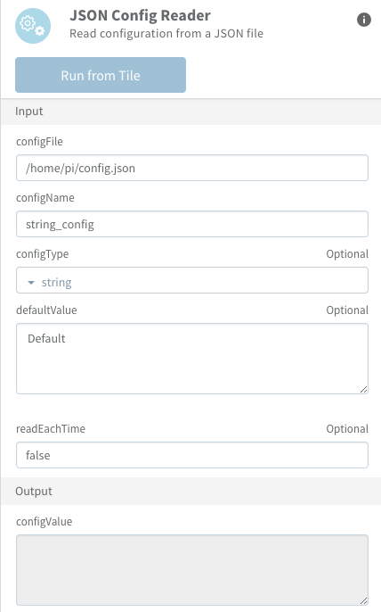
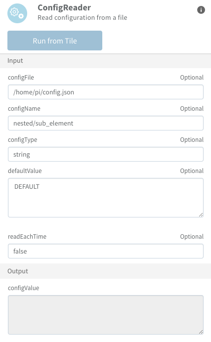

# Config Reader
This activity reads a JSON Configuration file. The configuration can then be used in following activities.
This activity can read String, Int, Float and Boolean configuration values.
Default value can be set
Configuration can be cached (and not read at each execution) for better performances

## Installation

```bash
flogo add activity github.com/philippegabert/flogo-contrib/activity/configreader
```

## Schema
Inputs and Outputs:

```json
{
  "inputs":[
    {
      "name": "configFile",
      "type": "string",
      "required": "true"
    },
    {
      "name": "configName",
      "type": "string",
      "required": "true"
    },
    {
      "name": "configType",
      "type": "string",
      "allowed" : ["string", "int", "float", "bool"]
    },
    {
      "name": "defaultValue", 
      "type": "any"
    },
    {
      "name": "readEachTime",
      "type": "bool"
    }
  ],
  "outputs": [
  	{
      "name": "configValue",
      "type": "any"
    }
  ]
}
```
## Settings
| Setting     | Description    |
|:------------|:---------------|
| configFile        | The path to the configuration file |         
| configName        | The name of the configuration element to retrieve |
| configType        | The type of the configuration element (string, int, float or bool) |
| defaultValue        | The default value to set if the configuration was not read correctly |
| readEachTime        | If set to true, the configuration file will be read at each execution of the flow. If set to false, the file will be read only once |
| configValue        | The value of the configuration |

## Configuration Examples


- Configuration will be read from file **/home/pi/config.json**
- Name of the configuration element is **string_config**
- Type of the configuration element is **string**
- Default value to apply if the conf. element is not found: "**Default**""
- Setting the "readEachTime" value to **false**: File will be read only once


## Example of configuration file
```
{
        "string_config" : "TIBCO",
        "bool_config": false,
        "int_config": 55,
        "float_config": 22.22
}
```


## Nested configuration
This activity use the library [Gonfig](https://github.com/creamdog/gonfig). Therefore, it is possible to access nested elements.

### Example of configuration file with nested elements
```
{
        "string_config" : "TIBCO",
        "bool_config": false,
        "int_config": 55,
        "float_config": 22.22,
        "nested": {
        	"sub_element": "FLOGO"
        }
}
```
### Syntax to access the nested element



## What do the logs say ?
Once the log level set to DEBUG, here is what is displayed by the activity when reading a configuration element:
```
2017-12-06 16:45:22.768 DEBUG  [engine] - Scheduling EVAL on task: ConfigReader

2017-12-06 16:45:22.768 DEBUG  [engine] - Step: 2

2017-12-06 16:45:22.768 DEBUG  [engine] - popped item off queue
2017-12-06 16:45:22.769 DEBUG  [model-tibco-simple] - Task Eval: Task[%!d(string=configreader_2)]:'ConfigReader'

2017-12-06 16:45:22.769 DEBUG  [activity-tibco-configreader] - Config file [/home/pi/config.json]
2017-12-06 16:45:22.769 DEBUG  [activity-tibco-configreader] - Variable readEachTime is not null.
2017-12-06 16:45:22.769 DEBUG  [activity-tibco-configreader] - Configuration name [nested/sub_element], Configuration type [string]
2017-12-06 16:45:22.770 DEBUG  [activity-tibco-configreader] - Input default value is [DEFAULT]
2017-12-06 16:45:22.770 DEBUG  [activity-tibco-configreader] - Getting config value...
2017-12-06 16:45:22.770 DEBUG  [activity-tibco-configreader] - Variable readEachTime = false
2017-12-06 16:45:22.770 DEBUG  [activity-tibco-configreader] - Need to read the configuration file...
2017-12-06 16:45:22.771 DEBUG  [activity-tibco-configreader] - Reading STRING value
2017-12-06 16:45:22.772 DEBUG  [activity-tibco-configreader] - Final value: FLOGO
2017-12-06 16:45:22.772 DEBUG  [activity-tibco-configreader] - Final value returned [FLOGO]
2017-12-06 16:45:22.772 DEBUG  [engine] - SET OUTPUT: configValue = FLOGO

2017-12-06 16:45:22.772 DEBUG  [engine] - OutputScope: &{map[] map[configValue:0x10815700] 0x10910d80 false}

2017-12-06 16:45:22.773 DEBUG  [engine] - SetAttr: configValue = FLOGO

2017-12-06 16:45:22.773 DEBUG  [engine] - Applying OutputMapper
2017-12-06 16:45:22.773 DEBUG  [engine] - AddAttr - name: _A.configreader_2.configValue, type: any, value:FLOGO

2017-12-06 16:45:22.773 DEBUG  [engine] - ToInstLinks: task=0x11faac

2017-12-06 16:45:22.774 DEBUG  [model-tibco-simple] - done task: ConfigReader
```
