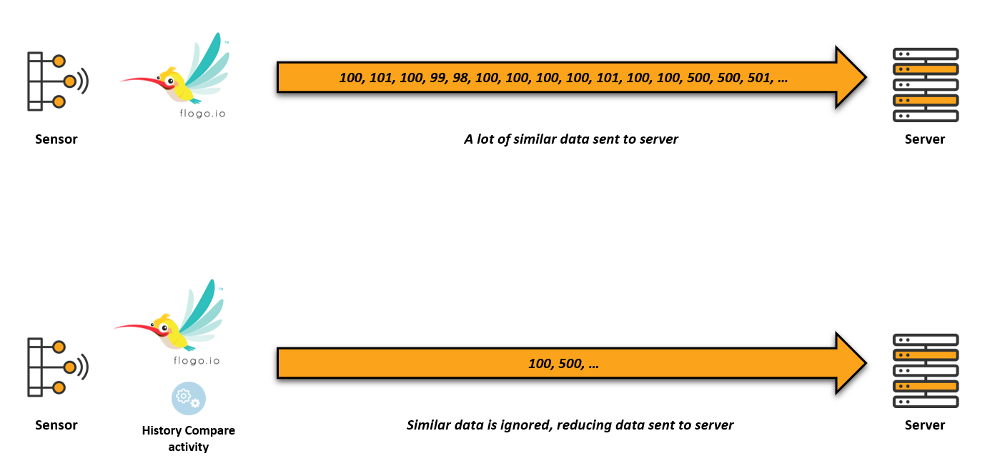

# Compare historical variable value
This activity allows you to store a variable in memory (shared across process instances) and compare values between the value stored in memory and the one given as input.

## Use case
Let's assume a IoT device with sensor reading external data. Data is then sent to a server to further actions.
Sensors may not be accurate and very similar readings should not be sent to the server.



## Installation

```bash
flogo add activity github.com/philippegabert/flogo-contrib/activity/histocompare
```

## Schema
Inputs and Outputs:

```json
{
  "inputs":[
    {
      "name": "varName",
      "type": "string",
	  "required": "true"
    },
	{
      "name": "varValue",
      "type": "number",
	  "required": "true"
    },
	{
      "name": "threshold",
      "type": "number",
	  "required": "true"
    },
	{
      "name": "thresholdUnit",
      "type": "string",
	  "allowed" : ["%"]
    },
	{
      "name": "storeIfInRange",
      "type": "boolean", 
	  "value": "false"
    },
	{
      "name": "storeIfExceed",
      "type": "boolean",
	  "value": "true"
    }
  ],
  "outputs": [
    {
      "name": "prevStoredValue",
      "type": "number"
    },
	{
      "name": "exceedThreshold",
      "type": "boolean"
    }
  ]
}
```
## Settings
| Setting     | Description    |
|:------------|:---------------|
| varName        | Name of the variable you want to store. |         
| varValue        | Current value of the variable |
| threshold        | Threshold value |
| thresholdUnit        | Threshold unit. Can be either empty or "%". <br/><ul><li>If empty, values are compared <ul><li>( absolute_value(oldValue - newValue) > threshold )</li></ul> </li><li>If %, percentage are calculated before comparing values  <ul><li>( absolute_value(oldValue - newValue) > (oldValue * threshold/100) )</li></ul></li></ul><ul></ul><br/>. |
| storeIfInRange        | New value is stored even if in range. Be careful, if set to true, you may not be able to detect slight changes ! |
| storeIfExceed        | New value is stored if threshold is exceeded |
| prevStoredValue        | Return the value that was previously stored. |
| exceedThreshold        | true is threshold is exceeded. |

